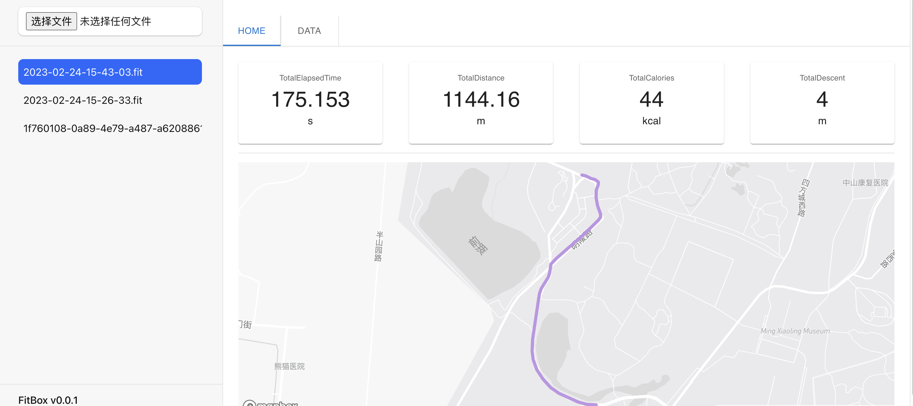

# FitBox
[](https://discord.gg/JKZJfEpT7b)
[](https://github.com/faaccy/FitBox/main/LICENSE)
[](https://github.com/faaccy/FitBox/main/README.md)


<p>This repo tend to visualize data from fit file.</p>

# Dependecies

packages
:------------ 
Vite 
react react-router 
@garmin-fit/sdk
@mui/material  
webworker

# How to build
```
npm install 
npm run build
```

# How to use

upload a fit file by sider input an then you can see the detail on the right panel.

# Features

Feature | Status
:------------ | :-------------
draw a line on Map | :heavy_check_mark: 
show the detail data by table | :heavy_check_mark: 
interact with chart and map | :white_square_button:
build with pake.js | :white_square_button: